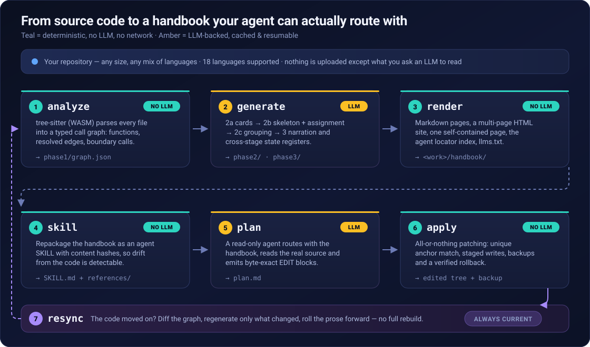
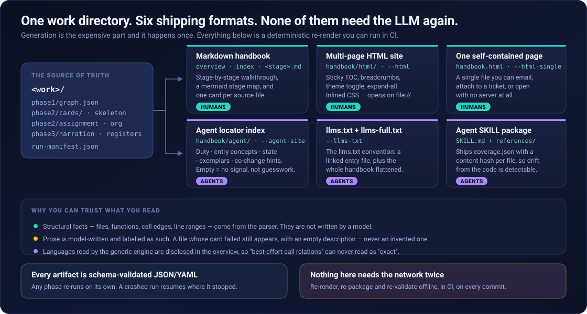
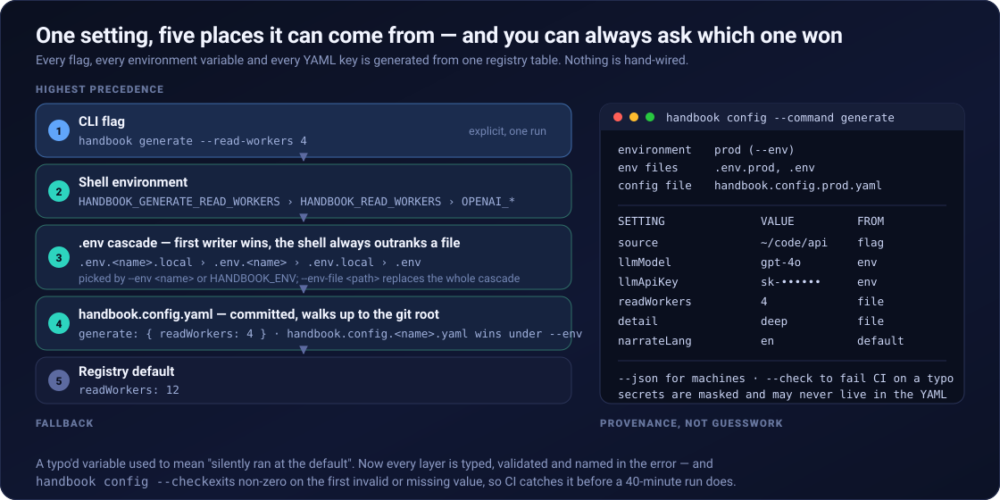
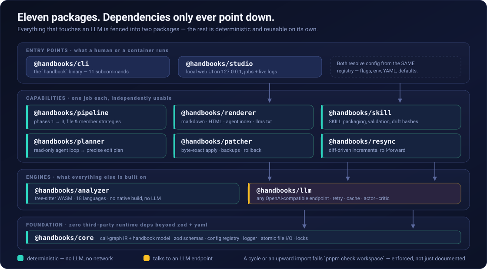

<div align="center">

# Handbook

**把任意代码库变成一本「手册」——让你的 AI 编码助手真正知道该改哪里。**

[](LICENSE)
[](.nvmrc)
[](#开发)
[](#语言支持)
[](#环境要求)

[English](README.md) · **中文**

</div>

<p align="center">
  
</p>

---

## 60 秒看懂

你有一个仓库。它大到装不进你的脑子，也大到装不进上下文窗口。你的 AI 助手 grep 一个符号，
找到了七处里的三处，改完这三处，然后交出了一个只改了一半的补丁。

**Handbook 解决的是「定位」问题。** 它用真正的语法解析器读你的代码，画出一张地图，
再把这张地图作为**位置索引**（不是代码摘要）交给 agent。之后代码变了，地图跟着变。

```bash
git clone <本仓库> && cd handbook
pnpm install && pnpm build
pnpm demo            # ← 完整跑通全流程，全离线，不需要任何 API Key，约 30 秒
```

最后这条命令会用内置的示例项目 + 内置的 mock LLM 把整条工具链跑一遍。跑完你的磁盘上就有了
一份渲染好的手册、一个 HTML 站点、一份 agent 定位索引，以及一个通过校验的 SKILL 包。
**一个 token 都不花。**

---

## 目录

- [这到底是什么](#这到底是什么)
- [你会得到什么](#你会得到什么)
- [环境要求](#环境要求)
- [快速上手 —— 8 步](#快速上手--8-步)
- [Studio：同样的事，改成点鼠标](#studio同样的事改成点鼠标)
- [生成是怎么工作的](#生成是怎么工作的)
- [配置](#配置)
- [语言支持](#语言支持)
- [仓库结构](#仓库结构)
- [命令速查表](#命令速查表)
- [Docker](#docker)
- [开发](#开发)
- [发布](#发布)
- [常见问题](#常见问题)

---

## 这到底是什么

### 先把问题说清楚

AI 编码助手很擅长**改**代码，很不擅长**找**该改的代码。你让它「上传失败重试三次」，
它会自信地改掉它找到的那个上传函数——然后漏掉重试策略的常量、批处理 worker 里的镜像实现、
统计重试次数的指标，以及那个断言旧行为的测试。

这不是推理能力不行。这是**定位**不行。它从头到尾就没见过地图。

### 答案由三件事构成

**1. 事实来自解析器，不来自模型。**
Handbook 用 tree-sitter 解析每个源文件，构建带类型的调用图：函数、方法、
通过 `self`/属性/参数/import 解析出的调用边、离开你代码边界的调用，以及**解析不出来的调用**
（单独隔离到 `dropped-calls.json`，绝不瞎猜）。这一层完全不碰 LLM，跑多少次结果都一样。

**2. 散文长在事实之上，而且明确标注。**
LLM 负责写人能读的部分——这个文件是干嘛的、这个子系统怎么串起来、哪些状态跨了哪些阶段。
它永远锚定在调用图上；哪里生成失败了，结构照样输出，只是描述是空的。
**少一句话，好过编一句话。**

**3. 这张地图是给「定位」用的，不是给「阅读」用的。**
输出不是你代码的摘要，而是一个能回答
_「这次改动必须碰哪些文件、哪些函数、哪些状态？」_ 的索引——**包括那些散落的、不显眼的位置**。
然后 planner 用这个索引，去读每一个查到的地址上的真实源码，最后产出一份精确到字节、
可以被机械执行的修改计划。

### 谁适合用

| 你是…                          | 你能拿到…                                                |
| ------------------------------ | -------------------------------------------------------- |
| 刚接手一个 20 万行服务的工程师 | 一份真的读得下去的分阶段导览，外加一个能分享的 HTML 站点 |
| 在大仓库上跑 AI 编码助手的人   | 一个 SKILL 包，让 agent 不再靠猜来找东西                 |
| 带新人的 team leader           | 会「重新生成」而不是「慢慢烂掉」的文档                   |
| 维护多语言 monorepo 的人       | 一次扫描覆盖 18 种语言，并且逐语言公开分析保真度         |

---

## 你会得到什么

<p align="center">
  
</p>

一次 `generate` + `render` 具体会产出：

- **Markdown 手册** —— `overview.md`（系统总览 + mermaid 阶段地图）、`index.md`（全部阶段，带层级）、
  每个阶段一页（文件卡片已分组），以及 `register.md`：一张跨阶段状态表，标明每个状态被哪些阶段触碰。
- **多页 HTML 站点** —— 侧边栏常驻目录、面包屑、会记住选择的主题切换、一键展开/收起。
  CSS 和 JS 全部内联，链接全部相对：直接 `file://` 打开就能用，不需要服务器，不依赖 CDN。
- **单文件 HTML** —— 整本手册压成一个文件，可以直接发邮件、丢进工单。
- **Agent 定位索引** —— 一层确定性的、事实门控的路由信息：职责、入口概念、涉及的状态、
  典型文件、联动改动提示、核心文件。**只有结构信号存在时才输出对应字段**，
  所以字段为空的意思是「没有信号」，而不是「不知道」。
- **`llms.txt` 和 `llms-full.txt`** —— [llms.txt](https://llmstxt.org/) 约定，
  外加把整本手册摊平成一份文档。
- **SKILL 包** —— `SKILL.md` + `references/`，其中 `coverage.json` 为每个文件带上内容哈希，
  于是 agent 能判断某一页是不是已经落后于代码了。

---

## 环境要求

- **Node.js ≥ 20.11** 和 **pnpm ≥ 9** —— 就这些。不需要本地编译，不需要 Python，
  不需要 `node-gyp`；解析器全是 WebAssembly。
- **LLM 阶段：** 任意 **OpenAI 兼容** 的 chat 端点。官方 OpenAI、Azure、vLLM、Ollama、
  LiteLLM、公司内网代理——只要它认 `/v1/chat/completions` 就行。

```bash
export OPENAI_API_KEY=sk-...                        # 阶段 2、3 需要
export OPENAI_MODEL=gpt-4o-mini                     # 默认 gpt-4o-mini
export OPENAI_BASE_URL=https://api.openai.com/v1    # 或者你自己的端点
```

本地无鉴权端点用 `OPENAI_API_KEY=EMPTY`。**阶段 1（静态分析）完全不需要 Key**，
所以 `handbook analyze` 永远免费。

不想在 shell 里 export？CLI 会自动从**当前目录**加载 `./.env`（shell 变量优先，
见 [.env.example](.env.example)），也可以显式传 `--env-file <path>`。
完整优先级见[配置](#配置)。

---

## 快速上手 —— 8 步

```bash
pnpm install && pnpm build

# 让 CLI 用起来顺手：
alias handbook="node $(pwd)/packages/cli/dist/main.js"
```

> 下面每个 `pnpm <命令>` 快捷方式都会先做一次增量 `tsc -b`（已是最新时约 0.4 秒），
> 所以你不可能跑到过期的 `dist`。

### 第 1 步 —— 先看再动：构建调用图（免费，不用 LLM）

```bash
handbook analyze --source /path/to/repo --work work/myrepo
```

```json
{ "language": "multi", "files": 412, "functions": 3187, "edgesKept": 9042, "edgesDropped": 611 }
```

这是你的冒烟测试。它写出 `work/myrepo/phase1/graph.json`，外加一份全部函数的 CSV
和一个 Graphviz `.dot`。**如果文件数看起来不对，先修这个，别急着花 token。**
`--lang auto`（默认）会一次性识别并合并所有语言。

### 第 2 步 —— 生成手册（这一步才花 token）

```bash
handbook generate --source /path/to/repo --work work/myrepo \
    --detail deep --synth-mode doctor --narrate-lang zh
```

依次跑阶段 1 → 2a → 2b → 2c → 3。中等规模仓库首次跑，请按「分钟」而不是「秒」来预期。
它**可续跑**（`--resume`）、**可取消**、**按内容哈希缓存**，所以崩了之后再跑会从断点继续。

大仓库建议先便宜地跑一遍，之后再升级：

```bash
handbook generate --source /path/to/repo --work work/myrepo          # brief 卡片 + 一次性骨架
handbook generate --source /path/to/repo --work work/myrepo \
    --phase 2a --detail deep --resume                                # 只把卡片做深
```

### 第 3 步 —— 渲染成人和 agent 都能打开的东西

```bash
handbook render --work work/myrepo --title "MyRepo 手册" \
    --html --html-single --agent-site --llms-txt
```

不用 LLM。想跑多少次跑多少次——放进 CI、每次提交都跑，都是免费的。

### 第 4 步 —— 打包成 agent SKILL

```bash
handbook skill --handbook work/myrepo/handbook --out skills/myrepo \
    --name myrepo --project "MyRepo" \
    --work work/myrepo --source /path/to/repo \
    --agent-dir work/myrepo/handbook/agent \
    --lang zh
```

`--work` + `--source` 会额外产出 `coverage.json`，里面每个文件一个内容哈希——
**这正是让「手册过期」变成可检测、而不是悄悄出错的关键。**

### 第 5 步 —— 校验

```bash
handbook validate --skill skills/myrepo --source /path/to/repo
```

检查结构、frontmatter 契约、索引与阶段页是否一致，并重新哈希源码来报告已经落后的页面。
失败时退出码非零，可以直接接进 CI。

### 第 6 步 —— 用它规划一次真实改动

```bash
handbook plan --source /path/to/repo --handbook skills/myrepo/references \
    --request "上传失败时重试三次再放弃" \
    --out plan.md
```

一个**只读**的 agent 循环：它只能 list / read / grep（永远不能写），先用手册定位，
再对照真实源码核实，最后产出 `plan.md`。计划结尾带一个机器可读的声明块：

````markdown
### EDIT 1

- file: `src/upload.py`
- where: `Uploader.send (~88)` —— 加上重试包装

```old
    response = self._client.put(url, data)
```

```new
    response = self._retry(lambda: self._client.put(url, data), attempts=3)
```

```json
{ "will_modify": ["Uploader.send"], "will_add": ["Uploader._retry"], "will_remove": [] }
```
````

如果 planner 拿不出可用的计划，它会**以非零退出码失败**，而不是把一句道歉写进
`plan.md`——否则脚本会开开心心地把它喂给 `apply`。

### 第 7 步 —— 逐字节地应用，并且留好退路

```bash
handbook apply --source /path/to/repo --plan plan.md --dry-run   # 只校验，绝不写盘
handbook apply --source /path/to/repo --plan plan.md             # 真的写
```

安全规则，按优先级：

1. **先全部校验，再分两阶段写。** 任何一处失败都会中止整次应用。写入先落成临时文件，
   全部落盘成功后才统一改名——如果改名中途失败，已经改名的文件会从刚刚的备份里还原。
2. **`old` 必须逐字节精确且唯一匹配。** 零个匹配说明代码已经变了；两个以上说明锚点有歧义。
   两种情况都拒绝执行。
3. **每个被改的文件都带着补丁前的哈希被备份**，所以回滚能*证明*自己还原的正是这次补丁替换掉的字节。
4. **任何路径都不能逃出 source root**——包括通过软链接的父目录。

后悔了？

```bash
handbook rollback --backup /path/to/repo/.handbook-patches/<时间戳>
```

对于打完补丁**之后**又被改动过的文件，回滚会拒绝还原，除非你加 `--force`。

### 第 8 步 —— 让手册跟上代码

一个 resync **case** 是你自己组装的一个目录：现在的代码树，加上计划说了什么。

```
cases/upload-retry/
  edited/       改动后的仓库副本   （必需）
  plan.md       第 6 步的计划       （可选 —— 让范围更精确）
  change.diff   本次改动的 unified diff （可选 —— 让范围更完整）
```

```bash
mkdir -p cases/upload-retry
cp -R /path/to/repo cases/upload-retry/edited
cp plan.md cases/upload-retry/
handbook resync --case cases/upload-retry --work work/myrepo
```

resync 会重新分析改动后的树，把新旧调用图做 diff，然后**只重新生成变了的那部分**——
被改文件的卡片、新增文件的归属、受影响阶段的组织结构、受影响的叙述。
`work/myrepo/handbook` 下已经渲染过的产物会自动刷新（`--no-render` 可跳过）。

手边没有端点？`--no-llm` 只做结构刷新，并把散文标记为「已过期」，而不是假装它还是新的。

---

## Studio：同样的事，改成点鼠标

```bash
pnpm studio                    # → http://127.0.0.1:4860
pnpm studio --port 5000        # 参数直接透传
```

一个覆盖整条工具链的本地 Web UI：仓库注册表、带实时日志流的生成、手册浏览器、影响面图、
源码查看器，以及完整的 **plan → dry-run → apply → rollback → resync** 闭环。

默认只绑定 `127.0.0.1`，并且它的 CSRF 防护检查的是 `Host` 请求头，
所以除非你自己改，它就是个本地工具。

---

## 生成是怎么工作的

|  阶段  | 做了什么                                                                                                                                                                                                                                             | 用 LLM？ |
| :----: | ---------------------------------------------------------------------------------------------------------------------------------------------------------------------------------------------------------------------------------------------------- | :------: |
| **1**  | 语言适配器（tree-sitter，WASM）把每个文件解析成带类型的调用图：函数、方法、解析出的调用边（`self`/属性/参数/import）、进入第三方代码的边界调用，以及**解析不出来的调用**——后者被隔离进 `dropped-calls.json`，绝不猜测。                              |    ❌    |
| **2a** | 每个文件生成一张**卡片**：用途、角色、生命周期；`--detail deep` 时再加 120–300 字的走读，以及逐函数的用途 / 数据流 / 关系，并合并到调用图事实上。分批、三级降级、崩溃安全、可续跑。                                                                  |    ✅    |
| **2b** | 从目录汇总和入口点合成一份阶段**骨架**（按执行生命周期排序的叙事主线），然后把每个文件精确归到一个阶段。`--synth-mode doctor` 会跑一个 actor–critic 修复循环（工程师 / 架构师 / 读者三种评审视角），直到没有文件未归属、且没有结构性改动能通过评审。 |    ✅    |
| **2c** | 每个阶段内的文件按调用图拓扑排序，并分成 2–8 个有标题的小组。任何失败都降级成确定性的平铺顺序——**文件永远不会被丢掉。**                                                                                                                              |    ✅    |
| **3**  | 自底向上叙述：先子阶段后父阶段的阶段总览，然后是系统总览，最后用「循环直到无新增」的补漏轮提取跨阶段**状态寄存器**。全程按内容哈希缓存。                                                                                                             |    ✅    |

`--phase` 可以任意选子集：`all`、`1`、`2`（= 2a+2b+2c）、`2a`、`2b`、`2c`、`3`，
或者逗号列表如 `2c,3`。

### 两种策略

|          | `--strategy file`（默认） | `--strategy member`          |
| -------- | ------------------------- | ---------------------------- |
| 骨架     | 由 LLM 合成               | **你自己写** `skeleton.yaml` |
| 叶子单元 | 一个源文件                | 一个函数/方法                |
| 适合     | 你还不熟的仓库            | 你已经清楚结构的仓库         |
| 成本     | 较低                      | 较高——每个成员都要分类       |

策略会记录在 `<work>/phase2/strategy.json`，所以局部重跑（`--phase 3`）
绝不会悄悄跨策略。

### 工作目录

```
<work>/
  phase1/graph.json          调用图 —— 下游一切都读这个文件
  phase1/functions.csv       全部函数，平铺，方便 grep
  phase1/graph.dot           Graphviz，想看图的时候用
  phase1/dropped-calls.json  没解析出来的调用，已分类 —— 不藏着
  phase2/cards/<rel>.json    每个源文件一张卡片
  phase2/cards/_coverage.json
  phase2/skeleton.yaml       阶段主线
  phase2/assignment.json     文件 → 阶段
  phase2/organization.yaml   阶段内分组 + 阅读顺序
  phase3/narration.json      阶段与系统散文
  phase3/registers.json      跨阶段状态寄存器
  phase3/cache/              内容哈希缓存
  run-manifest.json          上一次成功运行的模型、阶段、耗时、token 用量
```

所有产物在读取时都会做 schema 校验。坏掉的产物会**响亮地报错并指名自己**，绝不往下传播。

---

## 配置

<p align="center">
  
</p>

每个设置只声明**一次**，在同一张 registry 表里。CLI 参数、环境变量名、配置文件键、
[.env.example](.env.example)、[handbook.config.example.yaml](handbook.config.example.yaml)
和 [docs/configuration.md](docs/content/docs/reference/configuration.md) 全都是从它**生成**的——所以它们不可能互相漂移。

### 优先级，从高到低

1. **CLI 参数** —— `--read-workers 4`
2. **Shell 环境变量** —— 先 `HANDBOOK_GENERATE_READ_WORKERS`，再 `HANDBOOK_READ_WORKERS`，
   再厂商别名如 `OPENAI_MODEL`
3. **`.env` 级联** —— 在任何读取之前就已经并入环境变量
4. **`handbook.config.yaml`** —— 从当前目录向上查找，到 git 根目录为止
5. **Registry 默认值**

### 多环境

```bash
handbook generate --env prod --source ~/code/proj --work work/proj
```

`--env prod`（或 `HANDBOOK_ENV=prod`）依次加载 `.env.prod.local` → `.env.prod` →
`.env.local` → `.env`，**先写入者胜**；并且优先选用 `handbook.config.prod.yaml` 而不是普通文件。
`--env-file <path>` 会完全绕过级联，只加载你指定的这一个文件。

### 直接问「现在到底是什么值」

```bash
handbook config                              # 一张表：每个设置、值、以及它从哪来
handbook config --command generate           # 只看某个子命令
handbook config --json                       # 机器可读
handbook config --check                      # 有任何非法或缺失就非零退出
```

`--check` 是该放进 CI 的那一个。以前打错一个环境变量名等于「悄悄用了默认值」；
现在它是一次构建失败，而且错误信息里点名了那个变量。

密钥（`llmApiKey` / `OPENAI_API_KEY`）在输出里会被打码，**永远不是命令行参数**，
而且一旦出现在配置文件里就会被**拒绝**——因为配置文件是要提交进仓库的。

完整参考：**[docs/configuration.md](docs/content/docs/reference/configuration.md)**。

---

## 语言支持

**完整保真层** —— 手写适配器，带类型驱动的调用解析、继承成员、逐属性的状态追踪：

| 语言           | 扩展名                                  |     | 语言         | 扩展名                   |
| -------------- | --------------------------------------- | --- | ------------ | ------------------------ |
| **Python**     | `.py`                                   |     | **Ruby**     | `.rb` `.rake` `.gemspec` |
| **TypeScript** | `.ts` `.tsx` `.js` `.jsx` `.mjs` `.cjs` |     | **PHP**      | `.php` `.phtml`          |
| **Go**         | `.go`                                   |     | **Swift**    | `.swift`                 |
| **Rust**       | `.rs`                                   |     | **Dart**     | `.dart`                  |
| **Java**       | `.java`                                 |     | **Solidity** | `.sol`                   |
| **C#**         | `.cs`                                   |     | **Shell**    | `.sh` `.bash`            |
| **C/C++**      | `.c` `.h` `.cpp` `.cc` `.cxx` `.hpp` …  |     |              |                          |

> JavaScript 由 TypeScript 适配器覆盖——没有单独的 JS 适配器要选。

**通用层** —— 一个配置驱动的引擎，每种语言一份声明式规格。文件与函数清单是精确的，
调用关系是尽力而为：

**Kotlin**（`.kt` `.kts`）· **Scala**（`.scala` `.sc`）· **Zig**（`.zig`）·
**Objective-C**（`.m`）· **OCaml**（`.ml`）

一本混用了两种保真层的手册会在总览里**明确说明**，所以「尽力而为的调用关系」
永远不会被误读成「精确」。

两个先说清楚、免得你后来才发现的注意事项：

- **Swift** 的语法在 V8 ≥ 13 上会让进程 abort。适配器会在发现阶段就拒绝，
  并给出解决办法（`node --liftoff-only`），而不是把你整次运行搞崩。
- 含 `case` 语句的 **Shell** 脚本会被跳过，因为那个语法会抛异常
  （它的外部扫描器 import 了一个当前 WASM 链接器没有提供的符号）。`case` 极其常见，
  所以**实际上大多数非平凡脚本都会被跳过**——在 `nvm` 上实测：6 个文件、122 个函数，全部落空。
  Shell 之所以列在完整层，是因为适配器本身是完整层的；但在上游修好那个语法之前，
  **请把 Shell 覆盖当作部分覆盖看待**。

两者都会写进扫描日志——绝不悄悄丢掉。

---

## 仓库结构

<p align="center">
  
</p>

| 包                                                  | 职责                                                                    | 用 LLM？ |
| --------------------------------------------------- | ----------------------------------------------------------------------- | :------: |
| [`@handbook/core`](packages/core/README.md)         | 数据模型（调用图 IR + 手册模型）、zod schema、配置 registry、零依赖工具 |    ❌    |
| [`@handbook/analyzer`](packages/analyzer/README.md) | 基于 tree-sitter WASM 的多语言静态调用图提取                            |    ❌    |
| [`@handbook/llm`](packages/llm/README.md)           | OpenAI 兼容 chat 客户端、磁盘缓存、actor–critic 编排、离线 mock         |    ✅    |
| [`@handbook/pipeline`](packages/pipeline/README.md) | 生成管线 —— 阶段 1–3，file 与 member 两种策略                           |    ✅    |
| [`@handbook/renderer`](packages/renderer/README.md) | Markdown 页面、agent 定位索引、HTML 站点、llms.txt                      |    ❌    |
| [`@handbook/skill`](packages/skill/README.md)       | SKILL 打包、校验、覆盖漂移检测                                          |    ❌    |
| [`@handbook/planner`](packages/planner/README.md)   | 手册驱动的只读规划 agent                                                |    ✅    |
| [`@handbook/patcher`](packages/patcher/README.md)   | 逐字节应用计划中的 EDIT 块 —— 全成或全不成、备份、回滚                  |    ❌    |
| [`@handbook/resync`](packages/resync/README.md)     | 代码变更后的手册增量前滚                                                |    ✅    |
| [`@handbook/studio`](packages/studio/README.md)     | 本地 Web UI：仓库 · 生成 · 浏览 · 演进                                  |    ✅    |
| [`@handbook/cli`](packages/cli/README.md)           | `handbook` 命令                                                         |    —     |

依赖方向严格单向：
`cli → pipeline/renderer/skill/planner/patcher/resync → analyzer/llm → core`。
碰 LLM 的代码和确定性代码用**包边界**隔开，所以 analyzer、renderer、patcher、skill
四个包可以完全脱离 LLM 独立复用。出现环或反向 import 会让 `pnpm check:workspace` 失败——
**这是被强制的，不只是写在文档里。**

---

## 命令速查表

下面每条脚本都会先做增量构建，参数直接透传——**不需要写 `--`**：

```bash
pnpm studio                                                 # 本地 Web UI → http://127.0.0.1:4860

pnpm analyze  --source ~/code/proj --work work/proj         # 静态调用图，免费
pnpm generate --source ~/code/proj --work work/proj --narrate-lang zh
pnpm render   --work work/proj --html --agent-site --llms-txt
pnpm skill    --handbook work/proj/handbook --out skills/proj --name proj
pnpm validate --skill skills/proj --source ~/code/proj

pnpm plan     --source ~/code/proj --request "给 export 加一个 --json 参数" --out plan.md
pnpm apply    --source ~/code/proj --plan plan.md --dry-run
pnpm apply    --source ~/code/proj --plan plan.md
pnpm rollback --backup ~/code/proj/.handbook-patches/<时间戳>
pnpm resync   --case cases/mycase --work work/proj

pnpm config:show --command generate                         # 现在是什么值，从哪来的
pnpm handbook --help                                        # 全部子命令
pnpm handbook <子命令> --help                                # 全部参数，含环境变量名与默认值
```

离线演示与 mock 端点：

```bash
pnpm demo             # examples/run-demo.sh —— 完整流程，全离线，零 token
pnpm demo:self        # 拿本仓库自己当输入（mock LLM）
pnpm demo:self:real   # 同上，但走 .env 里配的真实端点
pnpm mock-llm         # 只启动内置的 mock LLM 服务，端口 8099
```

> 走 LLM 的命令（`generate` 超过阶段 1、`plan`、不带 `--no-llm` 的 `resync`，
> 以及 Studio 的任务）会自动加载**当前目录**的 `./.env`，shell 变量优先——
> 所以请在仓库根目录运行，或者显式传 `--env-file`。

---

## Docker

不需要本地 Node/pnpm install。镜像基于 Node 22（**故意不用 24**，原因见 Dockerfile）
加上已构建好的包：

```bash
pnpm run docker:build     # docker build -t handbook:local .

# HANDBOOK_SOURCE=/src 和 HANDBOOK_WORK=/work 已经烤进镜像，所以你只需要挂卷：
docker run --rm -v "$PWD:/src:ro" -v handbook-work:/work handbook:local analyze
docker run --rm -v "$PWD:/src:ro" -v handbook-work:/work handbook:local generate --narrate-lang zh

# docker 自己的 --env-file 会叠加在工具链自身的 .env 加载之上 —— 两者都生效：
docker run --rm --env-file .env -v "$PWD:/src:ro" -v handbook-work:/work handbook:local generate

# 一个镜像服务所有环境（.env* 从不被打进镜像 —— 见 .dockerignore）：
docker run --rm --env-file .env.prod -e HANDBOOK_ENV=prod \
  -v "$PWD:/src:ro" -v handbook-work:/work handbook:local generate
```

用 compose 起 Studio：

```bash
pnpm run docker:studio    # docker compose up --build studio
```

> **只有 `http://localhost:4860` 能用——LAN IP 和容器名都不行。**
> Studio 的 CSRF 防护检查的是 `Host` 请求头，不是 socket。容器必须绑 `0.0.0.0`
> 发布的端口才可达，但这并不放宽「谁可以访问」：从宿主机浏览时发出的仍然是
> `Host: localhost:4860`，能通过；而写着 LAN IP 或容器主机名的请求会被 `403` 拒绝——
> 这是设计如此。远程访问是一个**故意还没实现**的独立功能（需要显式白名单），不是这条防护的漏洞。

---

## 开发

```bash
pnpm build             # tsc -b（composite project references）
pnpm test              # 构建 + vitest —— 全部离线运行
pnpm check             # 日常门禁；提交前跑这个
pnpm check:all         # check + 打包 + 安装冒烟 —— CI 跑的就是它

pnpm typecheck         # 先源码，再用 tsconfig.tests.json 检查测试
pnpm lint              # 全仓 eslint，零告警
pnpm format            # 全仓 prettier
pnpm test:coverage     # vitest + 每包覆盖率下限
pnpm check:workspace   # monorepo 的结构不变量
pnpm check:packaging   # 逐包 publint + are-the-types-wrong
pnpm check:install     # 打包、用原生 npm 安装、再驱动 CLI
pnpm check:cli         # 每个子命令与每层配置，端到端，全离线
```

`pnpm check` 按顺序跑：类型检查 → 工作区不变量 → eslint → prettier → 带每包覆盖率下限的测试。
它**故意**是快的那个。`pnpm check:all` 额外加上两道面向发布的门禁，
它们要打十一个 tarball，属于 CI 和发版前，而不是每次本地循环。
pre-commit 钩子只对暂存文件跑格式化和 lint；`commit-msg` 强制 Conventional Commits。

**测试哲学：全部离线。** 依赖 LLM 的流程用 `MockChatClient`（脚本化规则）和内置的
mock HTTP 端点测试；确定性的包直接测。**没有任何一个测试需要 API Key。**

四条**由工具强制、而非仅写在文档里**的约定：

- **版本只有一处。** 所有第三方版本都声明在 `pnpm-workspace.yaml` 的 catalog 里；
  各包依赖写 `"catalog:"`，绝不重复写版本范围。在 manifest 里写死范围会让
  `pnpm check:workspace` 失败。
- **`dist/` 就是发布面。** 构建工程排除 `*.test.ts`；`tsconfig.tests.json` 用 `noEmit`
  检查测试；source map 被排除出 tarball，因为它们指向永远不会发布的源文件。
- **覆盖率下限是逐包的。** 一个全仓数字会掩盖真正的问题：整体 86% 的时候，
  `@handbook/cli` 只有 23%。每个包有自己的下限，卡在实测值下面一点，于是只能往上棘轮。
- **测试把 `@handbook/*` 解析到源码而不是 `dist`。** 否则跨包被消费的代码，覆盖率会算不到任何地方。
  真实的 `dist` 由 `tsc -b` 和 `pnpm check:install`（用原生 npm 安装打好的 tarball 再驱动 CLI）验证。

贡献指南：[CONTRIBUTING.zh-CN.md](CONTRIBUTING.zh-CN.md) · 安全：[SECURITY.md](SECURITY.md) ·
行为准则：[CODE_OF_CONDUCT.md](CODE_OF_CONDUCT.md)

---

## 发布

发布由 [changesets](https://github.com/changesets/changesets) 驱动：

```bash
pnpm changeset        # 描述改动，选择版本递增方式
```

把生成的文件和代码一起提交。合入 `main` 后，Release workflow 会开一个
"Version Packages" PR，应用待处理的 changeset、递增版本号、写各包的 `CHANGELOG.md`。
合并那个 PR 就会发布到 npm——在没有配置 `NPM_TOKEN` secret 之前它是**惰性**的，
所以无论你现在发不发包，版本号和 changelog 都是对的。

---

## 常见问题

**我的代码会被上传到哪里吗？**
阶段 1 完全本地。阶段 2 和 3 会把文件内容发给**你自己配置的那个端点**——
那可以是跑在你本机上的模型。除此之外什么都不出去。
`--max-chars-per-file` 可以限制任何单个文件最多被发送多少字符。

**跑一次要花多少钱？**
取决于仓库规模和 `--detail`。先跑 `handbook analyze`（免费）看文件数，
再先用 `--detail brief` 跑一遍，之后才上 `--detail deep`。
每次运行都会把 token 用量写进 `run-manifest.json`，而 `--llm-cache` 让重跑几乎免费。

**如果 LLM 写错了怎么办？**
结构性事实不是 LLM 写的，所以路径、函数、行号范围在构造上就是对的。至于散文，
消费 SKILL 的 agent 被要求把矛盾之处追加到 `corrections.jsonl`；
之后 `handbook resync --corrections <file>` 会**只刷新其中点名的那些文件**。

**能完全不用 LLM 吗？**
可以，部分能。`analyze`、`render`、`skill`、`validate`、`apply`、`rollback`
从不碰 LLM；`resync --no-llm` 做结构刷新并把散文标记为过期，而不是假装它还是新的。

**我的语言不在列表里。**
加一个通用层语言只需要写一份声明式规格，不需要写新解析器——
见 [packages/analyzer/README.md](packages/analyzer/README.md)。

---

## 文档

- **[docs/](docs/)** —— 完整文档站（架构、每个命令、每个配置、格式、提示词、指南）
- [docs/configuration.md](docs/content/docs/reference/configuration.md) —— 全部配置项，由 registry 生成
- [examples/](examples/) —— 离线端到端演示，含 mock LLM 服务
- 各包 README 见 [packages/](packages/)

## 许可证

MIT —— 见 [LICENSE](LICENSE)。
